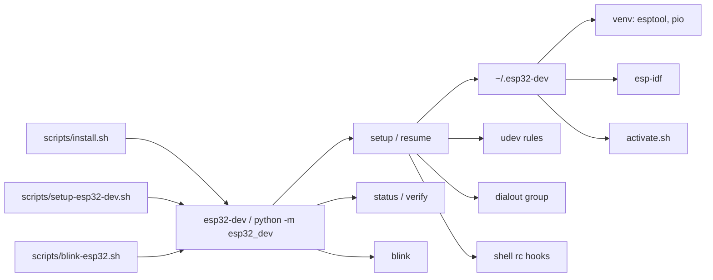
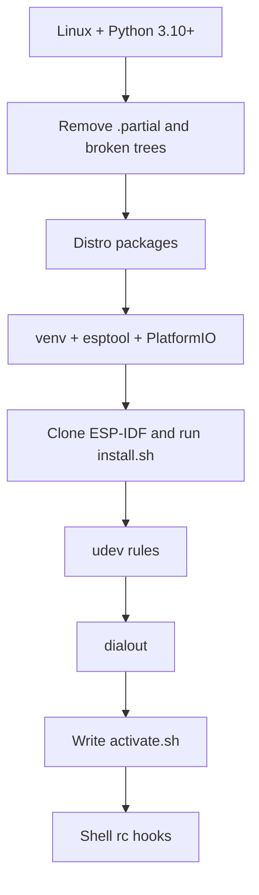

# Architecture

The Python package `esp32_dev` installs a shared toolchain prefix and exposes CLI commands to set it up, check it, and smoke-test a board. Shell wrappers in `scripts/` set `PYTHONPATH` so you can run that package from a clone without installing it.

## Prefix layout

Default prefix is `~/.esp32-dev` (`SetupConfig.prefix`). After a full setup:

| Path | Role |
|------|------|
| `activate.sh` | POSIX script: venv + `IDF_PATH` + ESP-IDF `export.sh` |
| `venv/` | Python virtualenv with esptool and PlatformIO |
| `esp-idf/` | ESP-IDF clone; `install.sh` has been run for the selected targets |
| `projects/blink/` | Generated PlatformIO project used by `blink` |

Host-side (not under the prefix):

| Path | Role |
|------|------|
| `/etc/udev/rules.d/99-esp32-dev.rules` | USB serial / JTAG access for common ESP32 adapters |
| `dialout` group | User membership for `/dev/ttyUSB*` and `/dev/ttyACM*` |

Incomplete clones and virtualenvs are written next to the real paths with a `.partial` suffix, then renamed. `setup` / `resume` delete leftover `.partial` trees and unusable `esp-idf` / `venv` directories before continuing.

## Components

| Piece | Responsibility |
|-------|----------------|
| `cli.py` | Argument parsing and dispatch |
| `installer.py` | Packages, venv, ESP-IDF, udev, dialout, activate script, status |
| `shell.py` | `activate.sh` / `activate.fish` and interactive-shell rc hooks |
| `blink.py` | Chip detect, PlatformIO blink sketch, serial confirm |
| `detect.py` | `/etc/os-release` → distro family and package list |
| `releases.py` | Resolve `latest` / `stable` to the current ESP-IDF GitHub release tag |
| `process.py` | `Host` and `Runner` (real OS vs tests; `--dry-run` skips mutating commands) |
| `skill_install.py` / `install.py` | Copy or symlink `esp32-dev/` into agent skill directories |

Firmware projects stay wherever the user keeps them. Toolchains stay in the prefix. Agents are told to follow that split by the [agent skill](features/agent-skill.md).

## Setup flow

Each of C–G and I can be skipped with a `--skip-*` flag. Details: [Setup](features/setup.md).

## Invocation

| How | Behavior |
|-----|----------|
| `. ./scripts/install.sh` | Runs `setup`, hooks future shells, activates this bash/zsh session |
| `./scripts/install.sh` | Same setup and hooks, without activating the current shell |
| `./scripts/setup-esp32-dev.sh` (no args) | Runs `python3 -m esp32_dev setup` |
| `./scripts/setup-esp32-dev.sh <args>` | Passes args through to `python3 -m esp32_dev` |
| `./scripts/blink-esp32.sh` | `python3 -m esp32_dev blink` |
| `python3 -m esp32_dev` or `esp32-dev` (no subcommand) | Prints help, exit 0 |
| `python3 install.py` | Agent skill installer; does not install ESP-IDF |

The Docker **runtime** image is this CLI only. It does not bake in ESP-IDF. See [Container](features/container.md).
