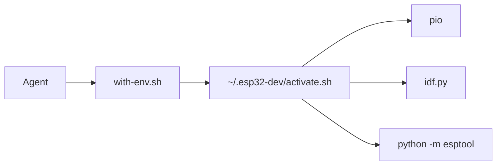

# Agent skill

Installs the **esp32-dev** skill so coding tools reuse the shared toolkit at `~/.esp32-dev` instead of pip-installing or cloning PlatformIO, ESP-IDF, or esptool.

## Overview

Skill source is `esp32-dev/SKILL.md` (plus `examples.md` and `scripts/with-env.sh`). The installer is `install.py` at the repo root. Flags match [brianlechthaler/skills](https://github.com/brianlechthaler/skills): project-local vs `-g` global, symlink vs `--copy`, `-a` agent, `--uninstall`.

Default install is a **symlink** into the agent skills directory so edits in this clone apply immediately. Use `--copy` if the clone will be removed. If symlink fails, the installer copies.

## Usage

From this repository:

```bash
python3 install.py --list
python3 install.py --list-agents
python3 install.py -a cursor -y                 # this project: .cursor/skills/esp32-dev
python3 install.py -g -a cursor -y              # user-wide: ~/.cursor/skills/esp32-dev
python3 install.py -g -a cursor --copy -y       # copy instead of symlink
python3 install.py --uninstall -g -a cursor -y --all
```

`-a all` installs to every supported agent path. If `-a` is omitted, the installer detects tools from home directories and `PATH` (Cursor, Claude Code, and others). If none are detected, it targets cursor, claude-code, and opencode.

Restart the coding tool (or start a new agent session) after install.

## Configuration

| Option | Default | Description |
|--------|---------|-------------|
| `-g`, `--global` | project-local | Install under the user home dir |
| `-a`, `--agent` | auto-detect | Target tool id, or `all` (repeatable) |
| `-s`, `--skill` | all skills in the repo | Skill directory name (this repo has `esp32-dev`) |
| `--copy` | symlink | Copy the skill directory |
| `--uninstall` | off | Remove an installed skill |
| `--all` | install: every skill in the repo | Required with `--uninstall` unless `-s` is set |
| `-y`, `--yes` | prompt | Skip confirmation |
| `SKILLS_REPO_ROOT` | cwd, then walk up from `skill_install.py` | Override the skill source root |

`--list` and `--list-agents` print and exit. They do not install.

Supported agent ids: cursor, claude-code, opencode, codex, windsurf, github-copilot, gemini-cli, openclaw, hermes-agent, mistral-vibe, aider, kilo-code, augment, antigravity, cline, roo, continue, trae, universal. Paths: `python3 install.py --list-agents`.

## After install



Agents that load the skill should:

1. Source `~/.esp32-dev/activate.sh` (or `$ESP32_DEV_PREFIX/activate.sh`)
2. Run `pio`, `idf.py`, and `python -m esptool` from that environment
3. If the prefix is missing, run this repo's `./scripts/setup-esp32-dev.sh` (or `python3 -m esp32_dev setup`) once, not a parallel pip/git toolchain

Helper after a skill install:

```bash
# repo checkout
./esp32-dev/scripts/with-env.sh pio run
# global Cursor skill
~/.cursor/skills/esp32-dev/scripts/with-env.sh python -m esptool chip_id
```

No arguments to `with-env.sh` prints prefix and tool versions.

Keep `platformio.ini` / `sdkconfig` in the firmware repo. Keep toolchains in the prefix. Command examples: `esp32-dev/examples.md`.

## Troubleshooting

**`no skills found`**: run `install.py` from a clone of this repo, or set `SKILLS_REPO_ROOT`.

**Symlink fails**: the installer falls back to copy. Pass `--copy` to skip the symlink attempt.

**Skill installed but agent still pip-installs pio**: restart the session; confirm the skill path with `python3 install.py --list-agents`.

**`ESP32 dest environment not found`** from `with-env.sh`: the toolkit is not installed at `$ESP32_DEV_PREFIX` or `~/.esp32-dev`. Run [setup](setup.md).

## Related

- [Getting started](../getting-started.md)
- [Setup](setup.md)
- [Architecture](../architecture.md)
