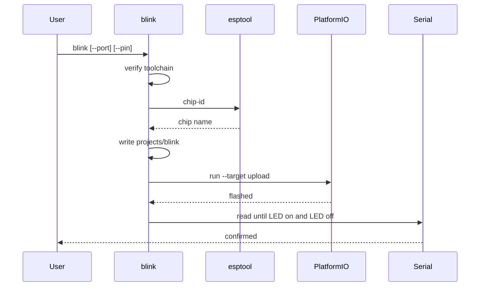

# Blink

Compiles and uploads a LED blink sketch to an attached ESP32, then confirms `LED on` and `LED off` on the serial console.

## Overview

`blink` first prints the same toolchain status as `verify` and aborts if required tools are missing. It then:

1. Picks a USB serial port (`/dev/ttyUSB*` or `/dev/ttyACM*`, or `--port`)
2. Runs esptool `chip-id` to identify the chip
3. Writes a PlatformIO Arduino project under `<prefix>/projects/blink`
4. Uploads with PlatformIO (`espressif32`)
5. Waits for the port to reappear and reads 115200 baud until both LED messages appear

The LED toggles every 500 ms. The first run may download the PlatformIO `espressif32` platform.

USB-CDC chips (S2, S3, C3, C6, H2, C2) get `ARDUINO_USB_MODE=1` and `ARDUINO_USB_CDC_ON_BOOT=1` so Serial works on the native USB port.

## Usage

```bash
./scripts/blink-esp32.sh
./scripts/setup-esp32-dev.sh blink --dry-run
python3 -m esp32_dev blink --port /dev/ttyACM0 --pin 48
```

`--dry-run` still checks tools, resolves the port and chip, and logs the write/upload steps. It does not compile, flash, or open serial.

## Configuration

| Option | Default | Description |
|--------|---------|-------------|
| `--prefix` | `~/.esp32-dev` | Toolkit prefix (venv + generated project dir) |
| `--port` | auto: exactly one of `/dev/ttyUSB*` or `/dev/ttyACM*` | Serial device |
| `--board` | from chip table | PlatformIO board id |
| `--pin` | from chip table | GPIO for the LED (0–48) |
| `--dry-run` | off | Do not compile or upload |

### Chip defaults

| Chip | Board | GPIO | USB CDC |
|------|-------|------|---------|
| ESP32 | `esp32dev` | 2 | no |
| ESP32-S2 | `esp32-s2-saola-1` | 18 | yes |
| ESP32-S3 | `esp32-s3-devkitc-1` | 48 | yes |
| ESP32-C2 | `esp32-c2-devkitm-1` | 8 | yes |
| ESP32-C3 | `esp32-c3-devkitm-1` | 8 | yes |
| ESP32-C6 | `esp32-c6-devkitc-1` | 8 | yes |
| ESP32-H2 | `esp32-h2-devkitm-1` | 8 | yes |

An unknown chip requires both `--board` and `--pin`.

## Flow



## Troubleshooting

**`required tools are missing`**: run [setup](setup.md).

**`no USB serial device found`**: plug in the board, install udev / join `dialout`, or pass `--port`.

**`multiple USB serial devices found`**: pass `--port`.

**`serial port not found`**: the given `--port` path does not exist.

**`unable to identify ESP32`**: hold BOOT, try another cable/port, or confirm esptool can talk to the chip.

**`serial console did not report 'LED on' and 'LED off'`**: wrong `--pin` for that board, or USB-CDC not enumerating. Override `--pin` / `--board`. Console timeout is 8 seconds after upload.

**`serial port disappeared after upload`**: USB re-enumeration took longer than 15 seconds. Unplug/replug and retry.

## Related

- [Setup](setup.md)
- [Getting started](../getting-started.md)
- [Agent skill](agent-skill.md)
