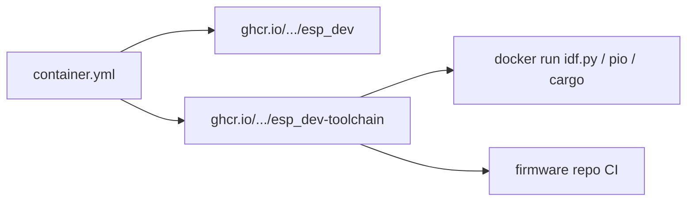

# Container

Docker images for tests, the `esp32-dev` CLI, and a firmware image with the toolchain already installed. GitHub Actions builds them. The CLI image and the toolchain image are published to GitHub Container Registry.

## Overview

The [Dockerfile](../../Dockerfile) has four stages:

| Stage | Contents | Entry |
|-------|----------|--------|
| `base` | Python 3.12 slim, package sources | none |
| `test` | `pip install -e ".[dev]"`, tests, Makefile, `install.py`, skill tree | `make` (default `test`) |
| `runtime` | `pip install .` (the CLI only) | `esp32-dev` (default `--help`) |
| `toolchain` | `runtime` plus `esp32-dev setup` into `/opt/esp32-dev` | `scripts/toolchain-entrypoint.sh` (default `idf.py --version`) |

The **runtime** image does not include ESP-IDF, PlatformIO platforms, Rust/espup, or a pre-built prefix. It is the installer CLI.

The **toolchain** image runs `esp32-dev setup` at build time. The prefix is `/opt/esp32-dev`. ESP-IDF tools go to `/opt/esp32-dev/.espressif` (`IDF_TOOLS_PATH`). PlatformIO packages go to `/opt/esp32-dev/platformio` (`PLATFORMIO_CORE_DIR`). The image build also compiles a tiny ESP-IDF project and a tiny PlatformIO `esp32dev` Arduino sketch, then deletes those trees, so the compilers and PlatformIO packages are already on disk. udev rules, `dialout`, and shell rc hooks are skipped: serial access stays on the host. Pass `--device` when you need to flash.

Build arg `IDF_TARGETS` (default `esp32`) is passed to `setup --idf-targets`. The PlatformIO warm-up is always the `esp32dev` Arduino board.

## Usage

Lint and tests (same as CI):

```bash
docker build --target test -t esp32-dev:test .
docker run --rm esp32-dev:test test
docker run --rm esp32-dev:test lint
```

CLI image:

```bash
docker build --target runtime -t esp32-dev:runtime .
docker run --rm esp32-dev:runtime --help
docker run --rm esp32-dev:runtime setup --dry-run
```

Host development without Docker is `make lint` and `make test` after `pip install -e ".[dev]"`. Coverage must stay at 100% (`pytest-cov` `--cov-fail-under=100`).

Firmware build (image entrypoint sources `/opt/esp32-dev/activate.sh` first):

```bash
docker build --target toolchain -t esp32-dev:toolchain .
docker run --rm -v "$PWD":/workspace -w /workspace esp32-dev:toolchain idf.py build
docker run --rm -v "$PWD":/workspace -w /workspace esp32-dev:toolchain pio run
```

`compose.yaml` mounts `${FIRMWARE_DIR:-.}` at `/workspace`:

```bash
FIRMWARE_DIR=/path/to/firmware docker compose run --rm firmware idf.py build
```

Copy [.env.example](../../.env.example) to `.env` to set `FIRMWARE_DIR` and `IDF_TARGETS` for local image builds.

Flashing uses the host serial device. The container does not install udev rules or join `dialout`:

```bash
docker run --rm --device /dev/ttyUSB0 -v "$PWD":/workspace -w /workspace \
  esp32-dev:toolchain idf.py -p /dev/ttyUSB0 flash
```

The default user is root, so build files on the mounted directory are root-owned. `GIT_CONFIG_*` marks every directory as a safe git directory so a host-owned firmware tree still configures.

## Published images

On `main` and version tags (`v*`), [`.github/workflows/container.yml`](../../.github/workflows/container.yml) builds `linux/amd64` and `linux/arm64` and pushes to:

| Image | Stage | Use |
|-------|-------|-----|
| `ghcr.io/brianlechthaler/esp_dev` | `runtime` | CLI |
| `ghcr.io/brianlechthaler/esp_dev-toolchain` | `toolchain` | Firmware builds |

Pull requests build but do not push. Tags include branch, semver, and git sha (see `docker/metadata-action` in that workflow). The toolchain image is built on native runners (`ubuntu-latest` and `ubuntu-24.04-arm`), then one manifest lists both platforms.

```bash
docker pull ghcr.io/brianlechthaler/esp_dev:main
docker run --rm ghcr.io/brianlechthaler/esp_dev:main --help

docker pull ghcr.io/brianlechthaler/esp_dev-toolchain:main
docker run --rm -v "$PWD":/workspace -w /workspace \
  ghcr.io/brianlechthaler/esp_dev-toolchain:main idf.py build
```

Image names follow the GitHub repository (`brianlechthaler/esp_dev`). GHCR may lowercase the path. A new GHCR package can stay private until it is linked to the repo (Packages, package settings, Manage Actions access).



## CI

| Workflow | Trigger | What it runs |
|----------|---------|----------------|
| [test.yml](../../.github/workflows/test.yml) | push/PR to `main` | Build `test` stage, `docker run … test` |
| [lint.yml](../../.github/workflows/lint.yml) | push/PR to `main` | Build `test` stage, `docker run … lint` |
| [container.yml](../../.github/workflows/container.yml) | push/PR to `main`, tags `v*` | Build `runtime` and `toolchain` for amd64/arm64; push except on PRs |

Test, lint, and image jobs cache with GitHub Actions cache (`type=gha`). The toolchain job uses a cache scope per platform.

## Related

- [Getting started](../getting-started.md)
- [Setup](setup.md)
- [Architecture](../architecture.md)
