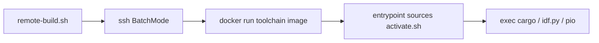

# Remote build

`scripts/remote-build.sh` runs one firmware command in the toolchain image on a remote host.

## Overview

The script SSHes with `BatchMode=yes` and runs `docker run --rm`. The remote directory is mounted at `/workspace`. The container command is whatever you pass after `--`.

The image is `ghcr.io/brianlechthaler/esp_dev-toolchain:main`. Its entrypoint sources `/opt/esp32-dev/activate.sh` and then execs that command, which is how `cargo`, `idf.py`, and `pio` get onto `PATH`. Pass those programs directly. A login shell (`bash -l`, `bash -lc`) resets `PATH` and will not see `cargo`.

`ghcr.io/brianlechthaler/esp_dev` (for example tag `70294c6`) is the installer CLI. It does not contain the toolchain.

The script does not copy sources. The tree must already be on the remote host. For the espcap firmware tree that path is `~/builds/espcap`.

## Usage

ESP32-S3:

```bash
./scripts/remote-build.sh \
  --host 100.66.116.123 \
  --remote builds/espcap \
  --workdir firmware \
  --env MCU=esp32s3 \
  --env IDF_MAINTAINER=1 \
  -- cargo build --release --target xtensa-esp32s3-espidf
```

ESP32-C5:

```bash
./scripts/remote-build.sh \
  --host 100.66.116.123 \
  --remote builds/espcap \
  --workdir firmware \
  --env MCU=esp32c5 \
  --env IDF_MAINTAINER=1 \
  -- cargo build --release --target riscv32imac-esp-espidf
```

Those become:

```bash
ssh -o BatchMode=yes -- "$HOST" \
  'docker run --rm -v "$HOME/builds/espcap:/workspace" -w /workspace/firmware -e MCU=... -e IDF_MAINTAINER=1 ghcr.io/brianlechthaler/esp_dev-toolchain:main cargo build ...'
```

`$HOME` expands on the remote host. Quote a tilde path so this machine does not expand it first: `--remote '~/builds/espcap'`. An absolute `--remote /srv/builds/espcap` is used as written on the remote host.

## Configuration

| Option | Default | Description |
|--------|---------|-------------|
| `--host` | required | SSH destination (`user@host` or an address) |
| `--remote` | required | Remote tree mounted at `/workspace`. A relative path is under the remote `$HOME` |
| `--workdir` | `.` | Directory under `/workspace` (`firmware` -> `/workspace/firmware`) |
| `--env KEY=VALUE` | none | Repeatable `docker -e` |
| `--image` | `ghcr.io/brianlechthaler/esp_dev-toolchain:main` | Toolchain image |
| `--` | required | Container command (`cargo`, `idf.py`, `pio`, …) |

Relative `--remote` values may contain letters, digits, `.`, `_`, `-`, and `/`. `..` and shell metacharacters are rejected.

## Diagram



## Troubleshooting

`cargo: not found` inside the container means the command was a login shell. Put `cargo` itself after `--`.

`docker: invalid reference format` or a missing tree means `--remote` expanded on this machine. Pass `builds/espcap` or quote `'~/builds/espcap'`.

SSH fails immediately when the host is unreachable or BatchMode has no key. The script exits with the SSH status.

## Related

- [Container](container.md)
- [Rust](rust.md)
