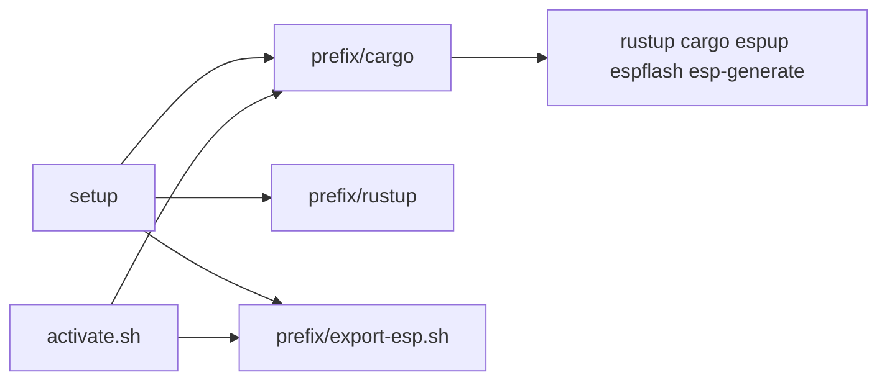

# Rust

Installs a prefix-local Rust toolchain for Espressif chips: rustup, RISC-V targets, the Xtensa compiler via `espup`, and cargo tools for generating and flashing projects.

## Overview

Setup follows [The Rust on ESP Book](https://docs.espressif.com/projects/rust/book/getting-started/toolchain.html). rustup is installed with the official installer (not a distro package). `CARGO_HOME` and `RUSTUP_HOME` live under the prefix (`~/.esp32-dev/cargo` and `~/.esp32-dev/rustup` by default) so the toolkit does not reuse or overwrite a user-level rustup.

`espup install` provides the Xtensa Rust fork (ESP32, ESP32-S2, ESP32-S3), LLVM, and GCC. RISC-V chips use stable Rust plus `rust-src` and the `riscv32imc` / `riscv32imac` targets.

Cargo crates installed into the prefix: `espup`, `ldproxy`, `espflash`, `cargo-espflash`, `esp-generate`.

Pass `--skip-rust` to omit this step. Host packages still include a C compiler, curl, pkg-config, and libudev (needed to compile those crates).

## Usage

```bash
source ~/.esp32-dev/activate.sh
rustc --version
cargo --version
espup --version
esp-generate --help
```

Create a `no_std` project and flash it:

```bash
esp-generate --headless -o esp32 my-esp-app
cd my-esp-app
cargo build
cargo espflash flash --monitor
```

Replace `-o esp32` with the chip (`esp32s3`, `esp32c3`, and so on). `esp-generate list-options` lists chips and features.

## Configuration

| Option | Default | Description |
|--------|---------|-------------|
| `--skip-rust` | off | Do not install rustup, espup, or ESP cargo tools |
| `--force` | off | Re-run rustup-init, `espup install`, and `cargo install --force` |

There is no separate Rust version flag. rustup uses `stable`. `espup install` uses its defaults (all Espressif targets).

## Layout



| Path | Role |
|------|------|
| `<prefix>/cargo` | `CARGO_HOME` (binaries in `cargo/bin`) |
| `<prefix>/rustup` | `RUSTUP_HOME` (stable + `esp` Xtensa toolchain) |
| `<prefix>/export-esp.sh` | Xtensa env vars from `espup` (`LIBCLANG_PATH`, PATH) |
| `activate.sh` | Sources cargo env and `export-esp.sh` |
| `activate.fish` | Prepends `cargo/bin` and converts `export-esp.sh` `export` lines |

## Troubleshooting

**`curl or wget is required`**: install curl (or wget) or do not pass `--skip-packages`.

**`missing required commands: gcc`**: install a C toolchain (`build-essential` on Debian) and re-run setup.

**Xtensa `cargo build` cannot find clang**: source `activate.sh` (or `export-esp.sh`) in this shell. Fish gets Xtensa vars from the converted exports written at setup time; re-run setup after `espup install` if those went stale.

**`verify` reports rustup MISSING**: re-run `setup` without `--skip-rust`. An older prefix from before Rust support needs that extra step.

## Related

- [Setup](setup.md)
- [Getting started](../getting-started.md)
- [Toolchain Installation](https://docs.espressif.com/projects/rust/book/getting-started/toolchain.html)
